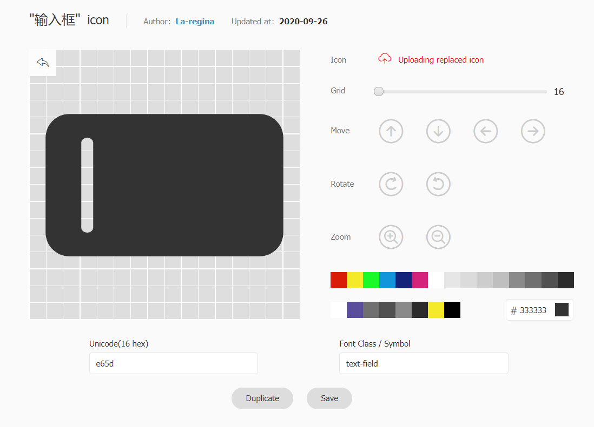

Вся тема добавляет поддержку иконок формата FontClass / Image в нескольких местах.

Вы можете использовать iconfont, iconify и fontawesome для добавления иконок в свой проект, а также использовать свои собственные ресурсы иконок.

Также поддерживается иконка формата png/svg. Вы можете использовать полные ссылки или пути для добавления иконок.

Мы рекомендуем вам использовать iconify или fontawesome.

<!-- more -->

## Обзор иконок

- Iconify: <https://icon-sets.iconify.design/>
- Iconfont: <https://www.iconfont.cn/?lang=en-us>
- Fontawesome: <https://fontawesome.com/icons>

## Настройка иконок

Вы можете использовать иконку в нескольких местах.

- Страница: установить `icon` в frontmatter

  Эта иконка будет использоваться в навигационной цепочке, заголовке страницы, сгенерированном элементе панели навигации, сгенерированном элементе боковой панели, навигации страницы и т. д.

- Navbar: установите опцию `icon` в NavbarItemConfig

- Sidebar: установите опцию `icon` в SidebarItemConfig

- HomePage: установите опцию `icon` в элементе функции

## Глобальные настройки

Вы можете задать URL-адрес ресурсов иконок и префикс иконок глобально через `iconAssets` и `iconPrefix`.

### Настройка ресурсов иконок

Вы должны задать ресурсы, связанные с иконками, в `iconAssets`, где вы можете установить:

- ключевые слова ресурсов иконок
- ресурс иконки в формате css и js
- массив выше

::: code-tabs#language

@tab TS

```ts {8}
// .vuepress/config.ts
import { defineUserConfig } from "vuepress";
import { hopeTheme } from "vuepress-theme-hope";

export default defineUserConfig({
  theme: hopeTheme({
    // keywords: "iconfont", "iconify", "fontawesome", "fontawesome-with-brands"
    iconAssets: "fontawesome",

    // an url you like
    iconAssets: "/base/my/font-icon/resource.js",

    // an array of above
    iconAssets: [
      "/base/my/font-icon/resource.js",
      "https://example/my/fonr-icon/resouce.css",
      "fontawesome",
    ],
  }),
});
```

@tab JS

```js {8}
// .vuepress/config.ts
import { defineUserConfig } from "vuepress";
import { hopeTheme } from "vuepress-theme-hope";

export default defineUserConfig({
  theme: hopeTheme({
    // keywords: "iconfont", "iconify", "fontawesome", "fontawesome-with-brands"
    iconAssets: "fontawesome",

    // an url you like
    iconAssets: "/base/my/font-icon/resource.js",

    // an array of above
    iconAssets: [
      "/base/my/font-icon/resource.js",
      "https://example/my/fonr-icon/resouce.css",
      "fontawesome",
    ],
  }),
});
```

:::

Например, вы можете использовать [iconfont.cn](https://www.iconfont.cn/?lang=en-us) и [fontawesome](https://fontawesome.com) для создания собственных ресурсов.

Для простоты мы добавили встроенные ключевые слова `"iconfont"`, `"iconify"`, `"fontawesome"` и `"fontawesome-with-brand`, чтобы вы могли легко начать работу.

::: caution

Если вы используете этот плагин для документации коммерческого проекта, `iconfont` **не рекомендуется**, поскольку сам по себе iconfont является платформой для изучения/обмена дизайнерами и разработчиками.

Каждая иконка загружается пользователями, и вы должны получить разрешение от автора для коммерческого использования. Также может быть случай, когда загрузчик соблюдает условия использования. и загружать иконки, авторские права на которые принадлежат третьей стороне.

:::

### Настройка префикса иконки

`iconPrefix` — это префикс иконки, который вы хотите установить.

Обычно у вашего класса иконок должен быть общий префикс, для классов иконок `iconfont` это `iconfont icon-<ICON-NAME>`, а для бесплатных классов иконок fontawesome `fas fa-<icon-name>`. Поэтому, когда вы устанавливаете вышеуказанную опцию `assets` с ключевыми словами или одной ссылкой, сгенерированной с веб-сайта iconfont, набора шрифтов fontawesome или fontawesome CDN, плагин распознает их и устанавливает префикс как `"iconfont icon-"` и `"fas fa-"` автоматически для вас.

В других случаях, когда вы используете iconify или свой собственный URL-адрес, вы можете вручную установить эти параметры самостоятельно. В конце концов, писать `icon: apple` всегда лучше, чем что-то вроде `icon: iconfont icon-apple`, `icon: mdi:icon-apple` или `icon: fa-solid fa-apple`.

## Продвинутый

### Использование наборов Fontawesome

Вы можете приобрести их на [fontawesome.com](https://fontawesome.com) , чтобы использовать комплекты или импортировать иконки брендов.

Наборы Fontawesome с профессиональными функциями поддерживают профессиональные иконки, больше стилей иконок и загрузку ваших собственных иконок.

::: note

Для получения дополнительной информации, пожалуйста, следуйте [документации fontawesome](https://fontawesome.com/).

- [Инструкции по использованию](https://fontawesome.com/docs/web/add-icons/how-to)
- [Список иконок](https://fontawesome.com/icons)

:::

### Создавайте свои собственные ресурсы иконок

[Iconfont](https://www.iconfont.cn/?lang=en-us) — это платформа для управления векторными иконками и коммуникации, созданная Alimama MUX.

Дизайнер загружает иконку на платформу Iconfont, а пользователь может настроить загрузку иконок в различных форматах. Пользователи также могут преобразовать иконку в шрифт.

#### Как использовать

Во-первых, вам нужно создать новый проект для установки и управления иконками вашего сайта:

1. Войдите в Iconfont с помощью GitHub или Weibo.
1. Найдите "Resources → My Projects" в верхней части веб-сайта и щелкните иконку "New Project" в правом верхнем углу.
1. Установите узнаваемое название проекта
1. Заполните `FontClass/Symbol prefix` с `icon-` (вы также можете заполнить в соответствии с вашими предпочтениями, но вам нужно установить это значение `iconPrefix` в настройках темы с дополнительным префиксом `iconfont`)
1. Семейство шрифтов, пожалуйста, сохраните `iconfont`


#### Импорт иконки

1. Свободно ищите через iconfont, чтобы найти иконку, которую вы хотите использовать, и нажмите кнопку "Add to Library" на иконке

   

1. После поиска всех иконок щелкните иконку "Add to Library" в правом верхнем углу, нажмите "Add to Project" ниже и выберите созданный проект, затем подтвердите.

#### Редактирование иконки

На странице проекта вы можете редактировать иконки в проекте, включая настройки положения, размера, поворота, цвета, номера Unicode и класса/символа шрифта.



#### Создание файлов иконок

1. Нажмите кнопку "Font Class" над проектом и нажмите "Generate".

   

1. Установите ссылку css на `iconAssets` в настройках темы.

#### Советы

::: tip

Если вы добавите новую иконку в будущем, повторно создайте новый адрес CSS и установите для него значение `iconAssets` в параметрах темы.

:::

::: warning Противоречия с частным характером

Иконка шрифта связывает каждую иконку с символом в области частных символов Unicode, символ, используемый iconfont, является случайным.

Iconfont попытается решить конфликты, назначив новый символ, если символ новой иконки по умолчанию уже используется в текущем проекте, однако в разных проектах могут возникать конфликты.

Поэтому мы не рекомендуем вам использовать несколько ссылок на иконочные шрифты в качестве активов. Если вы готовы это сделать, проверьте иконки, чтобы убедиться, что каждую иконку предыдущего проекта не перекрывается иконкой в более поздних.

:::
